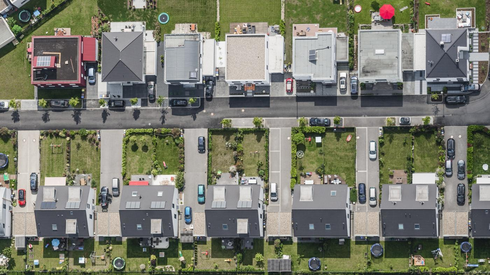

<!-- Featured Post -->
<article class="post featured">
		<header class="major">
				<h2><a href="#">Census Sampling  
					  causes lost  
										representativeness</a></h2>
				
Traditional sampling for household survey is done using government censuses,
					which can be outdated, or even deliberately underrepresenting certain populations,
					rapid urbanisation further exacerbates unrepresentativeness.
				

		</header>
		
		<header class="major">
			
SatSampling uses high-resolution satellite imagery in combination with
					Artificial Intelligence algorithms, in order to identify all dwellings,
					this (literally) ground-up approach, creates truely unbias samples, making surveys
					more representative than every before.
			

		</header>
</article>

<section class="posts">
	<article>
		<header>
		<h2><a href="link.html">title</a></h2>
		</header>
		
all the text of the post

		
</article>
</section>

<ul class="features">
	<li>
		
		<h3>Decades Out of Date</h3>
		
In certain countries, the last census may be decades old,
		entirely unreflective of the rapid urbanisation that has taken place since.

	</li>
	<li>
		
		<h3>Deliberate Exclusion</h3>
		
Censuses might have deliberately excluded vulnerable populations, be in by government or other forces.

	</li>
	<li>
		
		<h3>Unrepresented Populations</h3>
		
For reasons such as these and more, census-based surveys exclude large swaths of the population,
		introducing a bias before they even begin.

	</li>
</ul>

<!-- large icons -->
<ul class="features">
	<li>
		
		<h3>Aerial Imagery</h3>
		
High resolution satellite and other aerial imagery, is used to build a dataset from the ground up.

	</li>
	<li>
		
		<h3>Artificial Intelligence</h3>
		
Artificial Intelligence algorithms together with human supervision is used to identify houses

	</li>
	<li>
		
		<h3>Representative</h3>
		
Ground-up data, together with modern computer techniques allow for representative sampling.

	</li>
</ul>

<!-- statistics -->

<ul class="statistics">
	<li class="style1">
		
		<strong>100</strong> Countries
	</li>
	<li class="style2">
		
		<strong>8,192</strong> Space technology
	</li>
	<li class="style3">
		
		<strong>2,048</strong> pixels / km2
	</li>
	<li class="style4">
		
		<strong>4,096</strong> intelligable results
	</li>
	<li class="style5">
		
		<strong>1,024</strong> km2 of images
	</li>
</ul>

